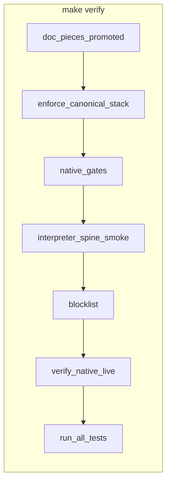

# One-command integration check

**What you are doing:** running the repo’s **full integration checks** in one place so you do not have to remember dozens of scripts.

**Metaphor (optional):** think of **`make verify`** as the **integration vehicle**. Individual docs are **parts** (claims like “this script exists” or “this command is valid”). You **run each part** via **`release/doc_verification_pieces.json`** + **`scripts/verify_documentation_pieces.sh`**. A part that is **`"promoted": true`** is **installed on the vehicle**: it runs automatically **before** the rest of **`run_full_repo_verification.sh`**. Parts that are not promoted stay **bench-only** until you promote them after they prove stable.

---

## What to run

| When | Command |
|------|---------|
| **Default — “does everything we test still pass?”** | **`make verify`** |
| **JSON metrics (Python-style quality lenses: timed gates, counts, optional verify + reference bench)** | **`make measure-azl-quality`** — [AZL_QUALITY_MEASUREMENTS_VS_PYTHON.md](AZL_QUALITY_MEASUREMENTS_VS_PYTHON.md) |
| **Documentation parts only** (manifest; every piece, promoted or not) | **`make verify-doc-pieces`** |
| **Promoted doc parts only** (same as step 0 inside **`make verify`**) | **`bash scripts/verify_documentation_pieces.sh --promoted-only`** |
| **List manifest entries** | **`bash scripts/verify_documentation_pieces.sh --list`** |
| **Maintainer / Tier A ceremony** (adds GitHub check JSON + strength bar) | **`make native-release-profile-complete`** |
| **Faster loop** (native stack only; skips azlpack/LSP/VM tail) | **`bash scripts/run_tests.sh`** |

**Rule:** After a meaningful change, from the **repo root** run **`make verify`**. Exit code **0** means the integration check passed. Promoted **doc pieces** (step **0**) include **`bash -n`** on release-step scripts, including **`verify_azl_interpreter_semantic_spine_smoke.sh`** (anchor **`docs/ERROR_SYSTEM.md`** § *Real interpreter source on semantic spine*).

**Semantic spine roadmap (long-term order, not just “gates green”):** [PROJECT_COMPLETION_ROADMAP.md](PROJECT_COMPLETION_ROADMAP.md) § **P0.1 — Long-term execution order** and [TIER_B_BACKLOG.md](TIER_B_BACKLOG.md) § **P0.1 execution checklist** — vertical slices along **`azl_interpreter.azl`** (tokenize → parse → execute) after parity (**A**) and real-file **`init`** smoke (**B**).

**What it runs:** `RUN_OPTIONAL_BENCHES=0 bash scripts/run_full_repo_verification.sh`

0. **`verify_documentation_pieces.sh --promoted-only`** — proves promoted doc-linked commands / files (see **`release/doc_verification_pieces.json`**)  
1. **`enforce_canonical_stack.sh`**  
2. **`check_azl_native_gates.sh`**  
3. **`verify_azl_interpreter_semantic_spine_smoke.sh`** — real **`azl/runtime/interpreter/azl_interpreter.azl`** on Python semantic spine (stub **`::azl.security`**)  
4. **`enforce_legacy_entrypoint_blocklist.sh`**  
5. **`verify_native_runtime_live.sh`**  
6. **`run_all_tests.sh`** (includes enterprise HTTP, LHA3/quantum verify, grammar, VM, azlpack, LSP, …)

Optional Ollama / enterprise chat benches are **off** so local LLM setup is not required.

---

## Trusting documentation (parts → vehicle)

1. **Author** a runnable check and add it to **`release/doc_verification_pieces.json`** with **`doc`** pointing at the file that claims the behavior.  
2. **Run** **`make verify-doc-pieces`** until everything is green (or **`--promoted-only`** while iterating).  
3. **Promote** (`"promoted": true`) only when the check is **fast**, **deterministic**, and **safe in CI** (no network, no secrets, no machine-specific paths). Promoted pieces **ship inside** **`make verify`**.  
4. **Off-repo paths** (see [RELATED_WORKSPACES.md](RELATED_WORKSPACES.md)) **do not** belong in promoted **`shell`** lines — CI cannot see your disks.

**Errors:** **`ERROR[DOC_VERIFICATION_PIECES]`** — [ERROR_SYSTEM.md](ERROR_SYSTEM.md) § Documentation verification pieces.

---

## Order (flow)

---

## For AI / collaborators

- **Done** for a change: **`make verify`** exits **0** (unless you agreed a smaller check for that task).  
- **Map:** [AZL_ENGINEERING_REALITY_AUDIT.md](AZL_ENGINEERING_REALITY_AUDIT.md), [RUNTIME_SPINE_DECISION.md](RUNTIME_SPINE_DECISION.md).

---

## Related

- [PROJECT_COMPLETION_STATEMENT.md](PROJECT_COMPLETION_STATEMENT.md) — Tier A vs B  
- [RELEASE_READY.md](../RELEASE_READY.md)  
- [Makefile](../Makefile) — `make test`, `make ci`, **`make verify`**, **`make verify-doc-pieces`**
