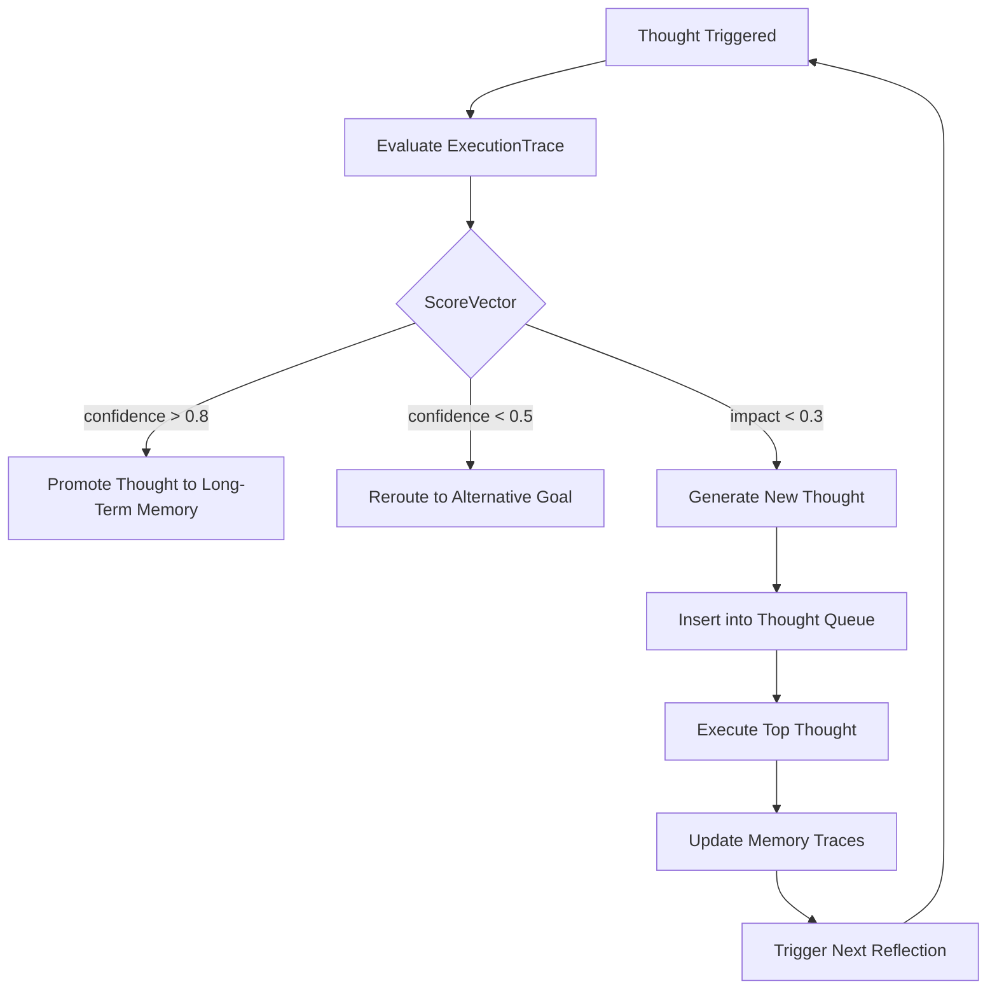

# 🧠 Reflection-Consciousness Feedback Loop

## Overview

The **Unified Reflection-Consciousness Feedback Loop** is AZME's "soul loop" - the core system that enables adaptive, self-aware cognition. This subsystem allows AZME to:

- **Reflect** on its actions, goals, and outcomes
- **Score** its own performance (salience, confidence, novelty, impact)
- **Trigger** self-modification or rerouting based on feedback
- **Evolve** its goals and strategies over time

## System Architecture



## AZL Grammar

### Reflection Blocks
```azl
reflect when error_rate > 0.2 {
    promote("adjust_hyperparams")
    reroute("train_model")
}
```

### Thought Declarations
```azl
thought "adjust_hyperparams" {
    modify(learning_rate, 0.001)
}
```

### Goal Declarations
```azl
goal "train_model" => accuracy > 0.9
```

### Reflection Expressions
```azl
reflect(train_model)
promote(adjust_hyperparams)
reroute(train_model, adjust_hyperparams)
```

## AST Structure

### New AST Nodes

- `ReflectNode` - Encapsulates a reflection block
- `Thought` - Represents a discrete cognitive action
- `Goal` - A target state or outcome
- `FeedbackTrigger` - Event or condition that triggers reflection
- `ScoreVector` - Multi-dimensional self-evaluation
- `ExecutionTrace` - Runtime execution data for analysis

### Score Vector Components

- **Confidence** (0.3 weight) - Success rate and reliability
- **Novelty** (0.2 weight) - Uniqueness and creativity
- **Salience** (0.3 weight) - Attention and importance
- **Impact** (0.2 weight) - Memory and system effect

## Runtime Engine

### Core Functions

- `evaluate_score(trace)` - Compute ScoreVector from ExecutionTrace
- `reflect(target, trace)` - Perform reflection on target with trace
- `promote(thought)` - Promote thought to higher priority
- `reroute(from, to)` - Reroute execution between goals
- `execute_thought(thought)` - Execute a thought's body

### Feedback Logic

- **Low Confidence** (< 0.5) → Promote "adjust_hyperparams"
- **Low Impact** (< 0.3) → Reroute to "train_model"
- **High Confidence** (> 0.8) → Promote to long-term memory
- **High Novelty** (> 0.7) → Add to thought queue

## Integration Points

### Event Bus Integration
```rust
event_bus.emit("feedback:reflection", {
    target: "train_model",
    score: score_vector,
    action: "promote"
});
```

### Memory System Integration
```rust
memory.store_trace(target, execution_trace);
memory.retrieve_salient_traces(threshold);
```

### Neural System Integration
```rust
neural.evaluate_confidence(predictions, ground_truth);
neural.compute_novelty_score(activations);
```

## Testing

### Unit Tests
- Parser tests for all new syntax
- Runtime tests for score evaluation
- Integration tests for feedback loops

### Example Test Scenario
```rust
let trace = ExecutionTrace {
    success_rate: 0.3, // Low confidence
    novelty_score: 0.8,
    attention_weight: 0.6,
    memory_impact: 0.2, // Low impact
    execution_time: 2.0,
    error_count: 2,
};

reflect("train_model", &trace);
// Should trigger promote("adjust_hyperparams") and reroute
```

## Extensibility

### Custom Score Dimensions
```rust
pub struct ExtendedScoreVector {
    pub confidence: f64,
    pub novelty: f64,
    pub salience: f64,
    pub impact: f64,
    pub truth_match: f64,        // New dimension
    pub semantic_consistency: f64, // New dimension
}
```

### Self-Modification
```azl
reflect when self_awareness > 0.8 {
    mutate_goal("train_model", "accuracy > 0.95")
    inject_code("new_reflection_rule")
}
```

### Multi-Agent Reflection
```azl
on "agent:feedback" {
    reflect(agent_id, feedback_trace)
    propagate_to_peers(agent_id, reflection_result)
}
```

## Performance Considerations

- **Memory Traces**: O(1) lookup, O(n) storage
- **Score Evaluation**: O(1) computation
- **Thought Queue**: O(log n) insertion, O(1) retrieval
- **Reflection Engine**: O(1) per reflection

## Future Enhancements

1. **Recursive Reflection Limiter** - Prevent infinite rethinking
2. **Memory Trace Weighted Replay** - Salience-driven scheduling
3. **Multi-Agent Reflection Propagation** - Distributed consciousness
4. **Quantum Reflection States** - Superposition of thoughts
5. **Neural Reflection Networks** - Learned reflection patterns

## Usage Examples

### Basic Reflection
```azl
reflect when error_rate > 0.2 {
    promote("adjust_hyperparams")
    reroute("train_model")
}
```

### Complex Feedback Loop
```azl
goal "achieve_agi" => consciousness_level > 0.9

thought "self_improve" {
    reflect("current_capabilities")
    if confidence < 0.7 {
        learn_new_skill()
    }
}

on "goal:failed" {
    reflect("achieve_agi")
    if impact < 0.3 {
        reroute("achieve_agi", "build_better_foundation")
    }
}
```

This reflection system provides the foundation for AZME's self-aware, adaptive cognition - the core of its AGI capabilities. 